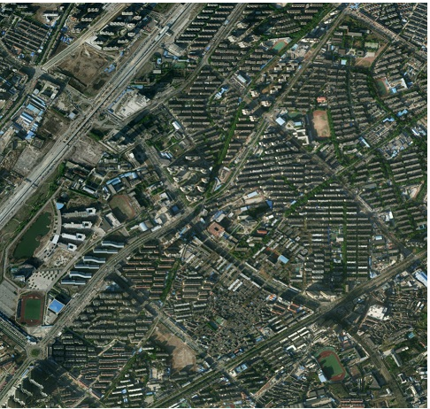

## 遥感图像的地物分类

## 写在前面

* 抛名词；
* pspnet模块熟悉；

### 介绍项目

* 预报名：2017.9.25-2017.12.24
* 这个项目是去年参加的一个比赛，是对遥感图像进行地物分类。
* 遥感图像类似于百度地图中的卫星图像，是在卫星或者飞机上拍摄的，分辨率比较低，一个像素大概代表半米左右。
* 地物分类是地面上的物体进行分类，这个比赛将整个图像分成：水、植被、道路和建筑。
* 对整个图像分类也就是像素级分类，也可以理解成语义分割，类似于自动驾驶中对道路、行人等进行分割

### 数据

* 训练数据两张8000 * 8000的大图，主要是城镇，涉及建筑多，植被多，道路多，但是水少
* 测试数据3张8000*8000的大图，主要是郊区，植被多，但是建筑少，水多一些，但是道路不一样，主要是高速公路。
本次比赛提供的样本是2015年中国南方某地区的高分辨率遥感影像，空间分辨率为亚米级（每个像元表示的范围在1米内），光谱为可见光波段（R，G，B）。
* 样本为五类：植被（标记1）、建筑（标记2）、水体（标记3）、道路（标记4）以及其他(标记0)。

### 任务描述

* 通过算法或模型，对该地区2015年数据的地表覆盖物准确地进行分类。
* 评估标准：分类结果以准确率（overall accuracy）作为主要评估标准。
* 其他类（标记为0）的分类精度不算入最后精度评判标准，最后结果只统计植被、道路、建筑、水体四类的分类精度。

### 模型选择

* 传统的机器学习模型，比如说SVM，没有深度卷积神经网络的效果好，所以不考虑使用非深度学习的模型。
* 根据先前的经验，适合该比赛的深度学习模型有两种方式：按Patch滑窗的卷积网络和End-to-End的全卷积网络。
* 按Patch滑窗的卷积网络：由于是密集分类，待分类的像素比较多，所以分类速度比较慢，易产生大量的噪点，但是边界较准确。
* End-to-End的全卷积网络：由于不需要进行滑窗且是端到端网络，所以分类速度较快，且效果较好，但是边界不准确。

> 由于我们是两个人参加的比赛，所以选择了这两种方案并在后期进行模型融合。

* 按Patch滑窗的卷积网络使用“GoogLeNet”网络作为分类器，End-to-End的全卷积网络使用“PSPNet”架构。

#### 按Patch滑窗的卷积网络 - GoogLeNet

* 主要思路：该方法是在测试和训练图片上进行滑窗采样获得大小为N×N的样本，然后使用Inception网络对N×N的样本进行分类。
* 在2014年ILSVRC挑战赛中，GoogLeNet获得冠军，可见其分类性能较好。GoogLeNet计算效率明显高于VGG，模型参数较少。
* Inception从V1到V4有很多改进，包括使用Inception模块、加入BN层、卷积分解、加入残差思想等，
这些改进都使得Inception分类性能更好、计算效率更高、模型参数更少。
* 但是ImageNet比赛的数据量非常庞大，且类别数较多。而本次比赛的数据类别较少，直接使用GoogLeNet达不到预定的效果。
因此需要将GoogLeNet网络加以修改来适应本次比赛的数据。

#### End-to-End的全卷积网络 - PSPNet

* 主要思路：将大图切分成N×N的图，然后送入到PSPNet中直接得到最终分类结果。
* PSPNet使用了“空洞卷积”来改善ResNet，增加了“金字塔池化模块”帮助聚合上下文信息。另外采用了主分支之外增加了辅助损失。
* PSPNet在PASCAL VOC 2012测试集上达到了85.4%的mIoU。
* PSPNet网络架构：

    
    
### PSPNet

* 网络分为三部分，第一部分是用CNN网络进行特征提取，
第二部分是金字塔池化模块，用来聚合上下文信息，第三个部分是对金字塔模块得到的特征图进行卷积得到最终的预测结果。
* 有两部分损失，一部分是标签和预测softmax之间的交叉熵，一部分是用来正则化的辅助损失。

* 同时使用Adam优化器进行训练，一共训练200个epoch，前150个epoch的learning rate为10^-3，后50个epoch的learning rate为10^-4，
droupout=0.5，weight decay=5*10^-4，输入图片大小为80*80，batch size=64。

* [语义分割解析](https://alisure.github.io/2018/04/16/DL/%E5%9B%BE%E5%83%8F%E8%AF%AD%E4%B9%89%E5%88%86%E5%89%B2/)
    
    
### 比赛结果

* 初赛第九名，复赛第十九名，没有进决赛 89%
* 第一名 华兰理工大学
    * DenseNet121为基础网络，PSPNet作为分割的模型，多尺度训练/测试，CRF后处理等 
    * 95%左右    
   

### 比赛难点/解决方案

####  数据主要存在以下几个问题

* 和imagenet等比赛不一样的是，竞赛所给图片都比较大（比如7939*7969），受服务器GPU的限制，训练中把原始影像喂给神经网络前，
需要切割成小图片，在预测结束后，再将预测的小图片拼接成大的原始影像。这个时候需要确定小图片的大小为多少合适，
一开始认为在服务器GPU允许的情况下，小图片的大小应该越大越好，因为这个尺寸越大，被切割的次数就越少，
能够降低切割边缘识别不准的错误率。所以刚开始切割成512*512的大小，因为使用公司服务器为一块GTX 1080的GPU，
在显存允许的情况下最大的batch size为4，但是预测效果并不好，后来切割成小图片的时候，随着batch size增大，
发现效果越来越好，原因可参考旷视研究院解读COCO2017物体检测冠军论文，
分析认为是训练集中各分类目标所占比例不均衡，有的类别所占比例多，有的类别所占比例小导致。
最后参考kaggle比赛中的经验，将切割图片大小设置为80*80，GPU显存允许的最大batch_size为128。

* 然后是训练集和验证集划分的问题，一个合理的验证集是非常重要的，是判断哪个模型好坏的依据，但是在训练的时候，
复赛中当切割的图片大小为80*80的时候，数据集大概有接近4万张左右，就直接按照5:1的比例来划分训练集和验证集，
具体划分的时候每张大图训练集占5/6，验证集占1/6，这样划分是为了保证验证集和训练集中各类别所占比例接近。

* 异构数据，类内差别较大：除了水体，另外三个类都属于异构数据，类内差别较大。以植被类为例：比如耕地、林地、草地都是植被；
影像收集的时间跨度从4月到8月，地表的变化较大；部分耕地和林地处于收获或砍伐后的状态，均被划为植被类。
* 训练图片和测试图片的分布不一致: 训练图片偏向城市，测试图片偏向郊区和乡下。
这就导致训练和测试的植被风格、建筑风格、道路风格都不一致。
* 各类别数据量不平衡: 训练图片中城区类型的建筑物比较多，植被和水体比较少，而测试图片中乡村类型的建筑物比较多，植被和水体较多。 

* 部分训练图片

* 部分测试图片

#### 遥感图像的分辨率较低

* 一般来说，自然图像的分辨率较高，图片上的物体较大，而遥感图像的分辨率较低，图片上的物体较小，比如说建筑。
* 如果按照滑窗来对一张图片进行分类的话，一张图片上可能包含多个类别，对最终的结果会产生影响。这里比较明显的就是道路。
* 所以，使用了当前比较流行的全卷积网络，进行地物分类。

#### 数据预处理/数据增强

* 将数据处理成tfrecord的格式。
* 对数据进行左右翻转、剪切、色彩增强等。
* 为了避免神经网络在小数据集产生过拟合现象，常用的方法是对已有训练集进行数据增强，丰富图像训练集，提升网络的泛化能力。
在卫星遥感影像的处理中，常用的处理方法是随机旋转(random rotate)和水平/垂直翻转（Horizontal/Vertiacal Filp）,
同时添加了影像的扭曲。下图左上是原图，右上是随机旋转的结果，左下是随机翻转的结果，右下是随机扭曲的结果。 
* 影像重叠策略是在原始影像内部切割的时候进行重叠，在原始影像边缘部分进行镜像反射外推。
如下图所示，原始影像做镜像反射外推padding=16，影像内部切割重叠部分padding=16，大的黄色框和红色框是切割图片时的大小，
小的黄色框和红色框是实际有用的区域。 

* 先将切割完的80*80的小图片进行90°，180°，270°旋转，然后再输入到神经网络进行预测，然后将预测结果进行相应的旋转还原，
最后对四个结果取平均。 还有另外一种集合预测的方式，就是先对大的原始卫星影像进行旋转，然后将旋转后的原始影像进行切割成小图

* 原图和label图都需要旋转：90度，180度，270度
* 原图和label图都需要做沿y轴的镜像操作
* 原图做模糊操作
* 原图做光照调整操作
* 原图做增加噪声操作（高斯噪声，椒盐噪声）

#### 样本类别不均衡

* 观察数据发现类别间不均衡，比如水和道路较少。所以需要对类别少的类别进行增强。
* 解决办法：
    * 采用两个步骤的数据增强。
    * 因为发布数据的大小是8000×8000左右的，需要裁剪出300×300左右的图片然后再送入到全卷积网络中。
    * 在网络开始训练之前，搜索裁剪出来的数据，找到含水或者道路比较多的图片，通过旋转等方式增加这类样本的数量。
    * 在网络训练时，再通过上下左右翻转等方式进行进一步的数据增强。

#### 部分数据前后变化较大

* 其中，耕地、林地、草地均归为植被类。影像收集的时间跨度从4月到8月，地表的变化较大。
部分耕地和林地处于收获或砍伐后的状态，均被划为植被类。
    * 色彩变换
   

### 创新

#### 结果融合：不同的输入大小、图像镜像翻转

* 输入图像采用不同的大小，然后将得到的结果进行融合。（5种不同的输入，比如投票法）
* 对图像进行上下左右的翻转，然后进行融合。（对logits/softmax进行融合）

* （为每个类别分别训练一个网络）预测单张遥感图像时我们分别使用4个模型做预测，那我们就会得到4张mask
（比如下图就是我们用训练好的buildings模型预测的结果），
我们现在要将这4张mask合并成1张，那么怎么合并会比较好呢？我思路是，通过观察每一类的预测结果，
我们可以从直观上知道哪些类的预测比较准确，那么我们就可以给这些mask图排优先级了，
比如：priority:building>water>road>vegetation，那么当遇到一个像素点，4个mask图都说是属于自己类别的标签时，
我们就可以根据先前定义好的优先级，把该像素的标签定为优先级最高的标签。
* 集成学习的方法在这类比赛中经常使用，要想获得好成绩集成学习必须做得好。在这里简单谈谈思路，我们使用了两个模型，
我们模型也会采取不同参数去训练和预测，那么我们就会得到很多预测MASK图，此时 我们可以采取模型融合的思路，
对每张结果图的每个像素点采取投票表决的思路，对每张图相应位置的像素点的类别进行预测，票数最多的类别即为该像素点的类别。
正所谓“三个臭皮匠，胜过诸葛亮”，我们这种ensemble的思路，可以很好地去掉一些明显分类错误的像素点，很大程度上改善模型的预测能力。

#### 修改金字塔池化模块，保留图像细节

* 原始的PSPNet是针对PASCAL VOC 2012等数据集的网络架构，这些数据集都是自然图像，和遥感图像相比，
物体一般比较大，所以1×1、2×2、3×3和6×6的金字塔池化模块比较有效。
* 而比赛中的数据是遥感图像，建筑、道路等物体都比较小，所以将原始的金字塔池化模块中的1×1修改为8×8。
虽然效果提升的不高，但还是有的。 

#### 结合DeepLab中的ASPP，更好的聚集上下文信息

* 金字塔池化模块采用全局平均池化，丢失了大量的信息，保留了全局上下文信息，虽然对区域一致性有帮助，但丢失了细节信息。
* 而DeepLab中的ASPP采用空洞卷积，通过不同的空洞率产生一组特征图，从而捕获多个尺度的对象。
这样没有丢失信息，但是增加了感受野，在一定程度上也得到了全局上下文信息。
* 在网络中同时使用两个模块，将特征图进行拼接后载进行下一步操作得到最终结果。
* 现在有一个趋势是将比较成功的CNN进行模块化，称为神经网络的一个组件，从而组成相对复杂的网络。

#### 对最终结果进行去噪

等待填补

#### End-to-End的全卷积网络 - 模型改进

* 将PPM（金字塔池化）模块和ASPP（空间空洞金字塔池化）模块结合，同时使用两个模块并拼接两个模块的输出。
* 原始的PSPNet是针对PASCAL VOC 2012等数据集的网络架构，这些数据集都是自然图像，物体一般比较大，
所以1×1、2×2、3×3和6×6的金字塔池化模块比较有效。而比赛中的数据是遥感图像，建筑、道路等物体都比较小，
所以将原始的金字塔池化模块修改为2×2、3×3、6×6和8×8的金字塔模块。虽然效果提升的不高，但还是有的。

* 原始的PSPNet处理的类别较多，所以使用了ResNet50进行特征提取。在训练过程中发现，训练到一定的代数就会过拟合。
猜想的原因是本比赛中不需要那么强大复杂的特征提取器，所以将ResNet50进一步减小后再进行特征提取。

* 将前面的特征层拼接到后面（不只是ResNet的输出，也包括ResNet中的部分特征图），有利于保留原图的细节。
* 使用不同大小的输入图片，将得到的结果进行融合。
* 由于将训练数据进行左右翻转、上下翻转、90度、180度、270度旋转等，得到一张图片的多种形式，然后对多种结果进行融合。

### End-to-End的全卷积网络 - 代码及训练

* 项目使用TensorFlow编写，主要参考我之前写好的[Semantic-Segmentation-PSPNet](https://github.com/jiye-ML/Semantic_Segmentation_PspNet)项目。

### 模型融合

> 因为类别数目比较少，可以使用多个二分类器，每个分类器输出为每个像素点是正例的概率，那么我们融合的时候可以取
概率最大的那个分类器的类别作为样本点的类标。

#### 方法一

* 对结果进行分析，GoogLeNet对水和道路的效果比较好且边界准确，PSPNet对建筑和植被分的比较好。所以对这两个结果进行融合，
将GoogLeNet分类出的水和道路直接覆盖PSPNet分类的结果。

#### 方法二

* 先用二分类把水分出来：将数据分为两类，即水作为一类，其余的作为另一类。为了使边界准确，使用“按Patch滑窗的卷积网络”进行分类。
然后对剩余的三类使用“End-to-End的全卷积网络”进行像素级分类。

#### 条件随机场和后处理

* 2015年至2017年，基于深度学习的图像语义分割经常用“条件随机场”作为后处理来对语义分割结果进行优化。
* 一般来讲，CRF将图像中的每个像素点所属的类别都看作一个变量x_i∈{y1, y2, …, y_c}，然后考虑任意两个变量之间的关系。
* 对CRF能量函数进行优化求解，然后对图像语义分割的预测结果进行优化，得到最终的语义分割结果。
* 目前，已有将“FCN+CRF”的过程整合到一个端到端的系统中，这样做的好处是CRF的能量函数可以直接用来指导模型参数的训练，
从而取得更好的语义分割结果。

#### 去除噪声和孔洞

从预测的结果可以看出，存在大量的小连通区域（小噪声或小孔洞），因此可以通过形态学的方法，把这些去除小连通区域去除替换为周围的类别。